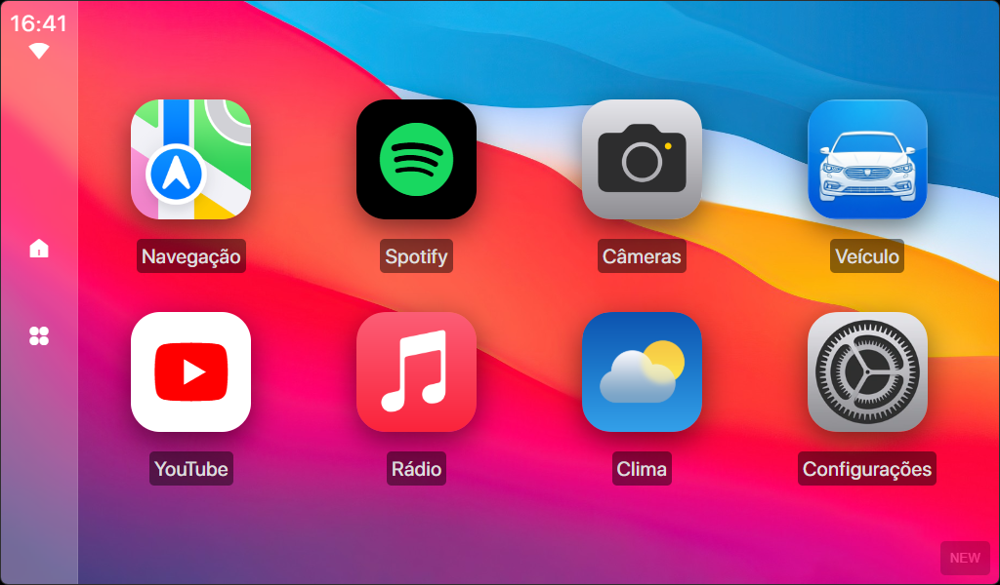
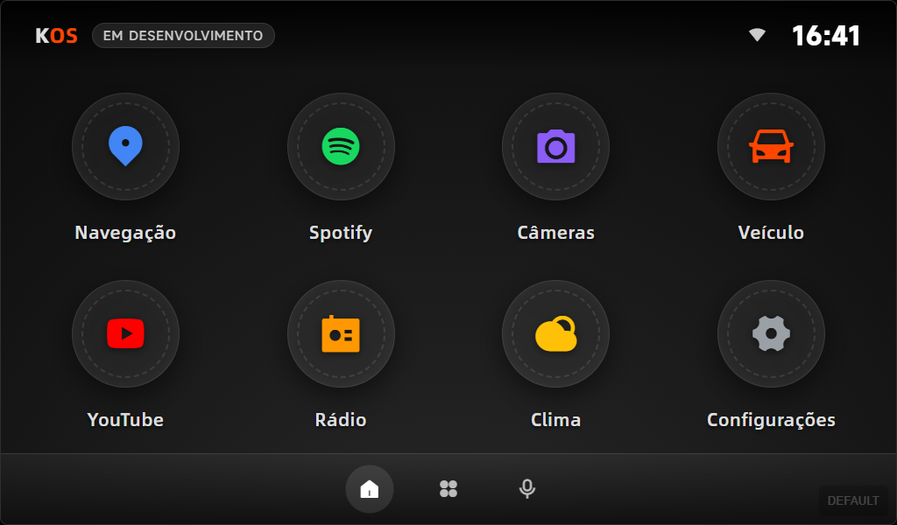
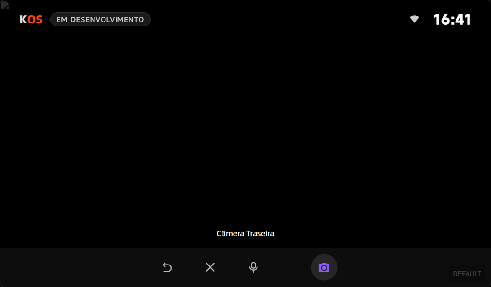
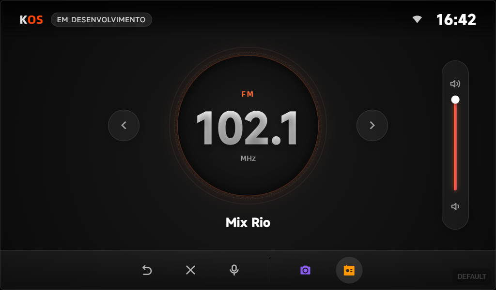
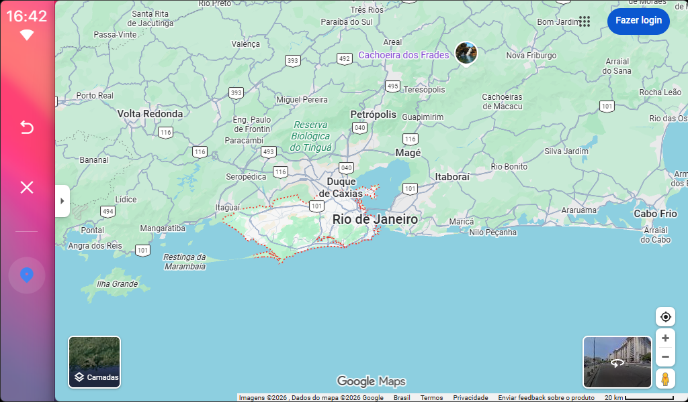

# KOS - OPERATING SYSTEM

  
  

## Português (PT-BR)

KOS é um sistema desenvolvido para um projeto caseiro de multimídia com **Rock Pi**. Ele combina um backend em **Python** com uma interface web interativa construída com **React**, permitindo:

- Executar aplicativos em tela touchscreen.
- Atualizações automáticas do projeto através do Git.
- Frontend moderno com *React* para desenvolvimento rápido e interface dinâmica.

No futuro, o KOS pretende aproveitar o **Waydroid** para também executar **aplicativos Android**, tornando o sistema ainda mais versátil.

O objetivo do KOS é fornecer um sistema compacto, automático e personalizável, ideal para displays interativos.

## English (EN)

KOS is a system developed for a home multimedia project using a **Rock Pi**. It combines a backend in **Python** with an interactive web interface built with **React**, allowing:

* Running applications on a touchscreen display.
* Automatic project updates via Git.
* A modern frontend with *React* for rapid development and a dynamic interface.

In the future, KOS aims to leverage **Waydroid** to also run **Android applications**, making the system even more versatile.

The goal of KOS is to provide a compact, automated, and customizable system, ideal for interactive displays.

## CAPTURAS DE TELAS / SCREENSHOTS

  
  
  
  

