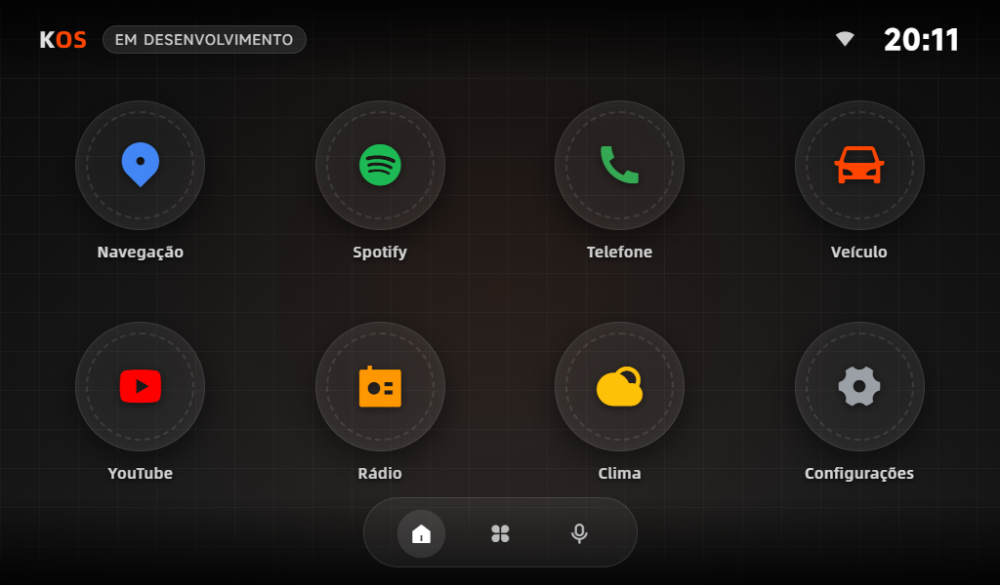
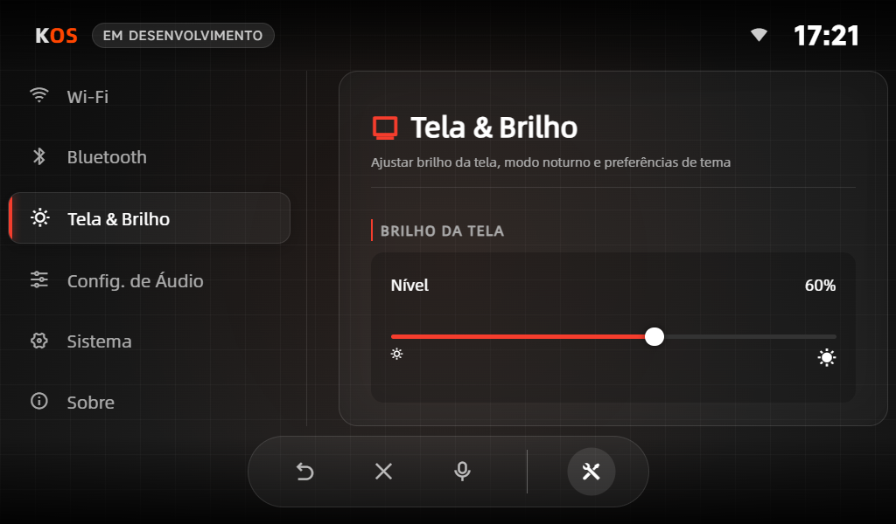

# KOS - OPERATING SYSTEM

  

  

## Português (PT-BR)

KOS é um sistema desenvolvido para um projeto caseiro de multimídia com **Rock Pi**. Ele combina um backend em **FastAPI** com uma interface web interativa construída com **React** e **Vite**, permitindo:

- Executar aplicativos via navegador em tela touchscreen.
- Atualizações automáticas do projeto através do Git.
- Interface em **Wayland** usando **Weston** e Chromium em modo kiosk.
- Swipe touchscreen e suporte a mouse para navegação entre páginas.
- Frontend moderno com **React + Vite** para desenvolvimento rápido e interface dinâmica.

No futuro, o KOS pretende aproveitar o **Wayland** para também executar **aplicativos Android**, tornando o sistema ainda mais versátil.

O objetivo do KOS é fornecer um sistema compacto, automático e personalizável, ideal para displays interativos.

## English (EN)

KOS is a system developed for a DIY multimedia project using the **Rock Pi**. It combines a **FastAPI** backend with an interactive web interface built using **React** and **Vite**, allowing:

- Running applications through the browser on a touchscreen.
- Automatic project updates via Git.
- Interface using **Wayland** with **Weston** and Chromium in kiosk mode.
- Touchscreen swipe and mouse support for page navigation.
- A modern frontend powered by **React + Vite** for fast development and dynamic UI.

In the future, KOS aims to leverage **Wayland** to also run **Android applications**, making the system even more versatile.

The goal of KOS is to provide a compact, automatic, and customizable system, ideal for interactive displays.
