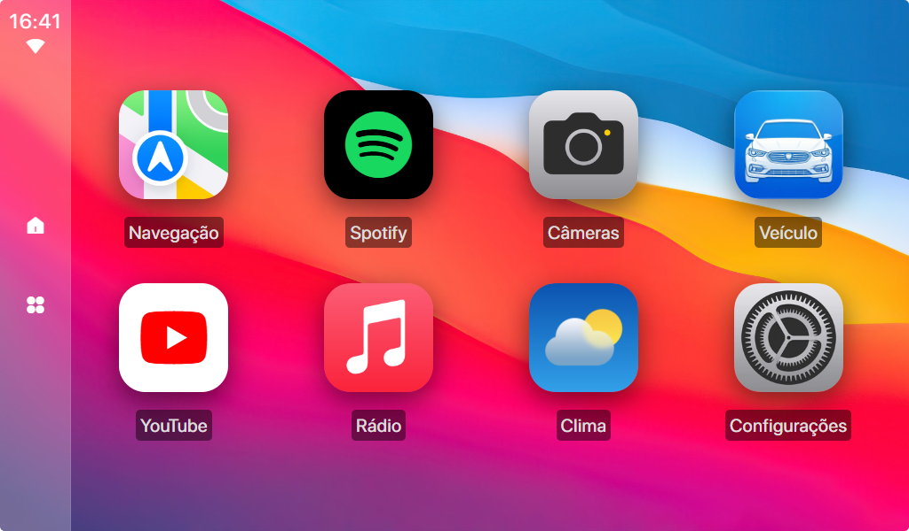
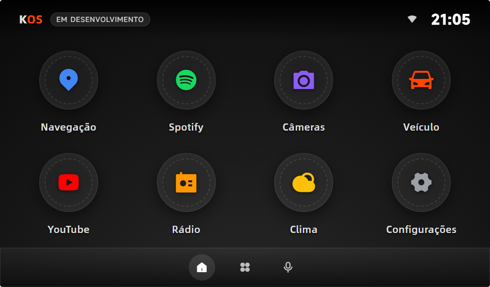
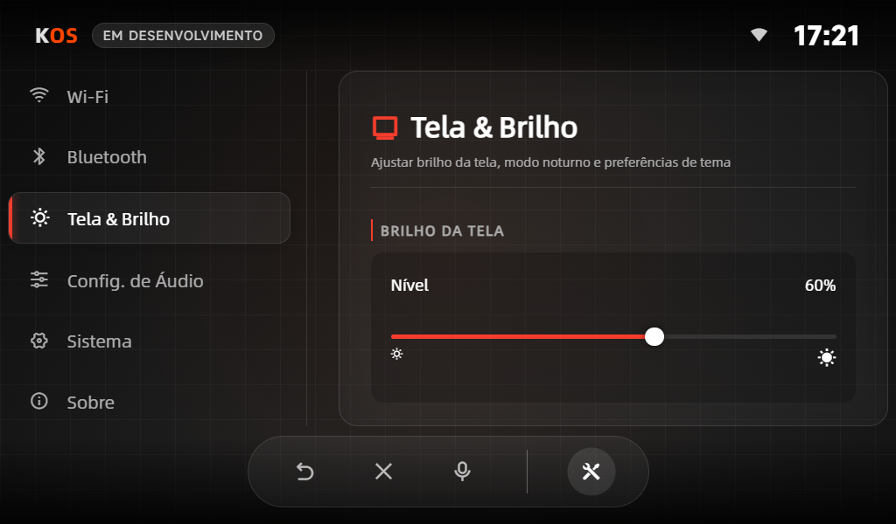
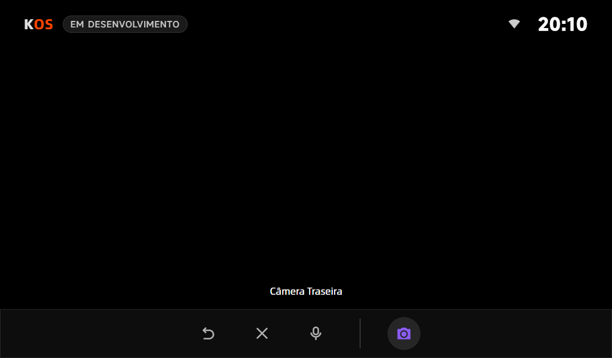
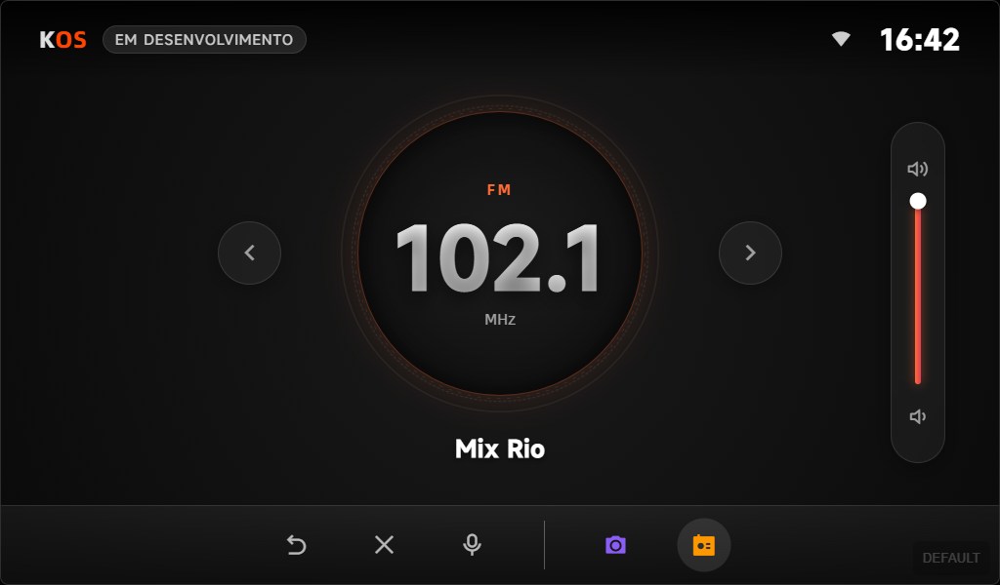
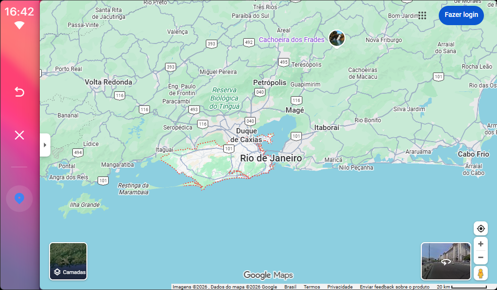

# KOS - OPERATING SYSTEM

  
  

<h2>Português (PT-BR)</h2>

KOS é um sistema desenvolvido para um projeto caseiro de multimídia com **Rock Pi**. Ele combina um backend em **TypeScript** com uma interface web interativa construída com **React**, permitindo:

- Executar aplicativos em tela touchscreen.
- Atualizações automáticas do projeto através do Git.
- Frontend moderno com _React_ para desenvolvimento rápido e interface dinâmica.
- Rastreamento e exibição de localização em tempo real via módulo **GPS**.

No futuro, o KOS pretende aproveitar o **Waydroid** para também executar **aplicativos Android**, tornando o sistema ainda mais versátil.

O objetivo do KOS é fornecer um sistema compacto, automático e personalizável, ideal para displays interativos.

<h2>English (EN)</h2>

KOS is a system developed for a home multimedia project using a **Rock Pi**. It combines a backend in **TypeScript** with an interactive web interface built with **React**, allowing:

- Running applications on a touchscreen display.
- Automatic project updates via Git.
- A modern frontend with _React_ for rapid development and a dynamic interface.
- Real-time location tracking and display via a **GPS** module.

In the future, KOS aims to leverage **Waydroid** to also run **Android applications**, making the system even more versatile.

The goal of KOS is to provide a compact, automated, and customizable system, ideal for interactive displays.

<h2>CAPTURAS DE TELAS / SCREENSHOTS</h2>

<h2>HARDWARE</h2>

### Rock Pi 4B+

### Arduino UNO R3

### TouchScreen 7"

### GPS GY-NEO-6Mv2

